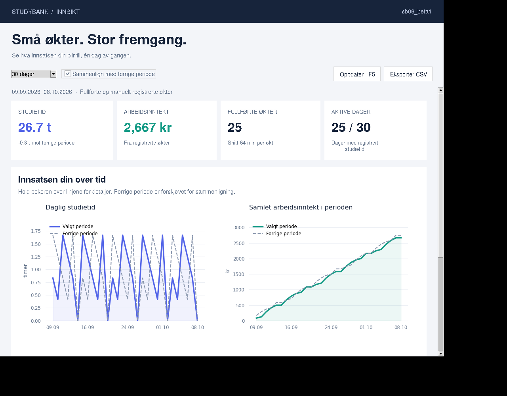

# StudyBank — sb06_beta1

Ny statistikkvisning for den eksisterende Python/Tkinter-appen. Starter med samme
økter, saldo, mål og innstillinger som SB05y. De tidligere versjonene er bevart.

## Start

Krever Python 3.10+ med Tkinter (på Debian/Ubuntu: `python3-tk`).

```sh
python -m pip install -r requirements.txt
python sb06_beta1.py
```

Klikk **Statistikk ↗**. Data leses fra `studybank_data.json` ved siden av appen,
uavhengig av hvilken mappe kommandoen kjøres fra. Ta en kopi av datafilen før du
prøver betaversjonen. Ikke kjør to appversjoner samtidig mot samme datafil.
Den vanlige appen beregner og lagrer saldo som før; statistikkvisningen er skrivebeskyttet.

## Statistikk

- 7, 30 eller 90 dager, med valgfri sammenligning mot like mange foregående dager.
- Linjediagrammer for daglig studietid og akkumulert arbeidsinntekt i valgt periode.
- Detaljer ved å holde pekeren over diagrammene.
- Nøkkeltall for timer, arbeidsinntekt, antall økter og aktive dager.
- Beste studiedag, sorterbar økthistorikk og CSV-eksport av valgt periodes økter.
- Rullbar side, F5 for oppdatering og Escape for å lukke.
- Tomtilstand og tilgjengelige nøkkeltall/eksport også uten matplotlib.

Statistikk bruker bare fullførte og manuelt registrerte økter. En økt tilordnes
lokal sluttdato, også når den krysser midnatt. Dager uten økter vises som null.
Forrige periode forskyves langs x-aksen for sammenligning. Inntekten kommer fra
historisk registrert lønn, ikke dagens timesats. Saldo og passiv avkastning er
**totaltall**, ikke periodetall; dataformatet har ingen historikk for avkastning.
Ugyldige økter utelates med en synlig melding. Ingen demodata legges til datafilen.

## Kontroll

```sh
python -m unittest -v test_studybank_stats.py
python -m py_compile sb06_beta1.py studybank_stats.py
```

`sb06_beta1.py` gjenbruker appfunksjonene fra `SB05y.py`, som derfor må ligge i
samme mappe. `studybank_stats.py` inneholder beregninger uten GUI-avhengigheter.

## Forhåndsvisning

Bildet viser syntetiske testøkter, ikke brukerens historikk.


